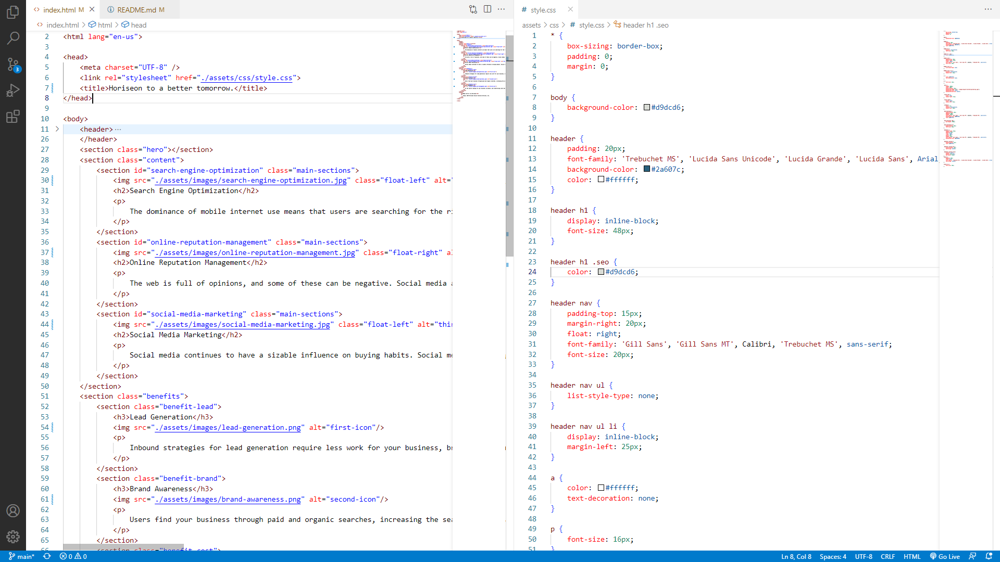

# Refactor-SEO-HW

## Description
I changed some codes from div tags to section so, so i can access them. I made alt tags for the img, i also fixed the linked to be directed to a section of then I made sections, so the HTML skeleton have a structure. I rearranged the CSS order to an order that can easily identified.

## Screenshot

## Deployed Link
[horiseon](https://johnfranco45.github.io/Refactor-SEO-HW/)

